# Shelf Roadmap

This roadmap describes how the _intended_ Shelf application evolves across the
full **Self-Testing AI Agents** course. It is a map of the target application
and repository state the workshop is building toward.

> [!NOTE]
> The published course materials assume a richer Shelf application than this
> local repository currently contains. This document is the canonical bridge
> between the current scaffold and the full course-shaped application.

## At a glance

```mermaid
flowchart LR
  A["Phase 0<br/>Shelf starter"] --> B["Phase 1<br/>Agent operating rules"]
  B --> C["Phase 2<br/>Testing hierarchy"]
  C --> D["Phase 3<br/>Playwright hardening"]
  D --> E["Phase 4<br/>Visual regression"]
  E --> F["Phase 5<br/>Runtime probes and custom MCPs"]
  F --> G["Phase 6<br/>Failure dossiers"]
  G --> H["Phase 7<br/>Review agents"]
  H --> I["Phase 8<br/>Static layer"]
  I --> J["Phase 9<br/>CI wiring"]
  J --> K["Phase 10<br/>Capstone: reading goals"]
```

## Phase 0: The Shelf Starter

**What Shelf is at the start:** a small SvelteKit + TypeScript book application
with enough real product surface to make the workshop meaningful.

**Core product shape:**

- Authentication for at least one normal user and one admin user.
- Book search backed by the Open Library API.
- A personal shelf with statuses like `reading` and `finished`.
- Per-book rating flows.
- Shelf and stats pages that reflect real user data.
- An admin surface for site-level features.

**Routes and surfaces the course assumes already exist:**

- `/login`
- `/search`
- `/shelf`
- `/shelf/:username`
- `/stats`
- `/design-system`
- `/goals`
- `/admin/goals`

**Repository baseline the course assumes already exists:**

- SvelteKit + TypeScript
- Vitest
- Playwright
- A real database-backed domain for users, books, and shelf entries

**Course material:**

- [Course overview](https://stevekinney.com/courses/self-testing-ai-agents)
- [The Hypothesis](https://stevekinney.com/courses/self-testing-ai-agents/the-hypothesis)

## Phase 1: Agent Operating Rules

**What changes in this phase:** the application code may barely move, but the
repository becomes teachable to an agent. The rules for how the agent should
edit, verify, and recover become explicit.

**New repository artifacts:**

- A strong `CLAUDE.md`
- Clear rules about what "done" means
- Rules that point the agent toward the correct verification loops instead of
  letting it improvise

**Why this phase matters:** the rest of the course assumes the agent is not
guessing. It should know where to look, what to run, and which shortcuts are
forbidden.

**Course material:**

- [Instructions That Wire the Agent In](https://stevekinney.com/courses/self-testing-ai-agents/instructions-that-wire-the-agent-in)
- [Lab: Rewrite the Bad CLAUDE.md](https://stevekinney.com/courses/self-testing-ai-agents/lab-rewrite-the-bad-claude-md)

## Phase 2: Testing Hierarchy and Intent

**What changes in this phase:** the team stops treating every check as equal.
Shelf gets a clear feedback hierarchy, from cheap static checks up through
expensive end-to-end and CI checks.

**What becomes clearer:**

- Which problems should be caught by lint or types
- Which problems should be caught by Playwright
- Which checks should be run locally during development
- Which checks are reserved for CI

**Why this phase matters:** it prevents the app from depending on the most
expensive possible check for every mistake.

**Course material:**

- [The Testing Pyramid as a Feedback Hierarchy](https://stevekinney.com/courses/self-testing-ai-agents/the-testing-pyramid-as-a-feedback-hierarchy)

## Phase 3: Playwright Hardening

**What changes in this phase:** Shelf's end-to-end tests stop being brittle and
start becoming trustworthy. This is the biggest application-quality jump in the
early course.

### 3.1 Locator discipline

**What changes:**

- Tests use semantic locators like `getByRole` and `getByLabel`.
- App markup needs stable accessible names and roles.

**What this does to the app:** UI structure becomes more intentional because the
tests now depend on accessibility semantics instead of CSS trivia.

**Course material:**

- [Locators and the Accessibility Hierarchy](https://stevekinney.com/courses/self-testing-ai-agents/locators-and-the-accessibility-hierarchy)

### 3.2 Waiting discipline

**What changes:**

- `waitForTimeout` disappears.
- Tests wait on real signals: visible UI, responses, navigation, or stable
  state transitions.

**What this does to the app:** asynchronous UI flows have to expose meaningful
signals instead of relying on timing luck.

**Course material:**

- [The Waiting Story](https://stevekinney.com/courses/self-testing-ai-agents/the-waiting-story)

### 3.3 Storage-state authentication

**What changes:**

- Login moves out of individual tests.
- `tests/end-to-end/authentication.setup.ts` logs in once and saves browser
  state.
- Playwright projects load that state automatically.

**What this does to the app:** authentication becomes a shared test concern
instead of duplicated UI setup in every spec.

**Course material:**

- [Storage State Authentication](https://stevekinney.com/courses/self-testing-ai-agents/storage-state-authentication)

### 3.4 HAR-backed network isolation

**What changes:**

- Open Library lookups stop hitting the live network during tests.
- HAR files are recorded once and replayed deterministically.

**What this does to the app:** search remains real in production, but test runs
become independent of upstream outages, latency, and response drift.

**Course material:**

- [Recording HARs for Network Isolation](https://stevekinney.com/courses/self-testing-ai-agents/recording-hars-for-network-isolation)

### 3.5 Deterministic data and parallel-safe tests

**What changes:**

- The database is seeded into a known state.
- Tests stop depending on leftovers from previous runs.
- Per-worker SQLite databases support `fullyParallel: true`.

**What this does to the app:** the shelf, search, rating, and stats features can
be tested repeatedly and in parallel without leaking data across runs.

**Course material:**

- [Deterministic State and Test Isolation](https://stevekinney.com/courses/self-testing-ai-agents/deterministic-state-and-test-isolation)

### 3.6 Hybrid API and UI tests

**What changes:**

- Tests use the `request` fixture for setup and targeted assertions.
- The UI is still used for the behavior actually under test.

**What this does to the app:** Shelf's API surface becomes part of the test
strategy. For example, shelf state can be created through `/api/shelf` and then
verified through `/stats` or `/shelf`.

**Course material:**

- [API and UI Hybrid Tests](https://stevekinney.com/courses/self-testing-ai-agents/api-and-ui-hybrid-tests)

### 3.7 The hardening lab

**What changes:**

- `tests/end-to-end/rate-book.spec.ts` is rewritten from a flaky demo into a
  stable, fast, isolated test.
- Rating becomes the canonical example of how Shelf should be tested.

**What this proves:** the app's most obvious user workflow can now be tested
repeatably on both fast laptops and slow CI machines.

**Course material:**

- [Lab: Harden the Flaky Rate-Book Test](https://stevekinney.com/courses/self-testing-ai-agents/lab-harden-the-flaky-rate-book-test)

## Phase 4: Visual Regression Becomes a First-Class Signal

**What changes in this phase:** Shelf is no longer only checked for behavioral
correctness. It is also checked for visual drift.

**New repository artifacts:**

- Screenshot tests using `toHaveScreenshot`
- Committed visual baselines
- A likely `/design-system` route used to snapshot shared UI states

**What this does to the app:**

- Layout, spacing, styling, and visual hierarchy are now part of the feedback
  loop.
- The shelf page and design system gain a machine-checkable visual baseline.

**Why this phase matters:** many agent mistakes are visual, not behavioral.
This phase gives the app a way to say "this looks wrong" without a human having
to open the page first.

**Course material:**

- [Visual Regression as a Feedback Loop](https://stevekinney.com/courses/self-testing-ai-agents/visual-regression-as-a-feedback-loop)
- [Lab: Wire Visual Regression Into the Dev Loop](https://stevekinney.com/courses/self-testing-ai-agents/lab-wire-visual-regression-into-the-dev-loop)

## Phase 5: Runtime Probes and Custom MCPs

**What changes in this phase:** Shelf gains live runtime probes that the agent
can call while it is still working, before a formal test or CI run fails.

### 5.1 Runtime probes

**What changes:**

- The agent probes changed routes directly during development.
- Browser console and network behavior become part of the active edit loop.

**What this does to the app:** routes like `/shelf` stop being black boxes. The
agent can navigate them, observe them, interact with them, and re-observe the
result after each edit.

**Course material:**

- [Runtime Tools Compared](https://stevekinney.com/courses/self-testing-ai-agents/runtime-tools-compared)
- [Runtime Probes in the Development Loop](https://stevekinney.com/courses/self-testing-ai-agents/runtime-probes-in-the-development-loop)

### 5.2 Custom verification MCPs

**What changes:**

- Shelf gets codebase-specific probes such as `verify_shelf_page`.
- Verification is wrapped into structured tools instead of ad hoc browser
  sessions.

**What this does to the app:** the shelf page, and eventually other critical
surfaces, gain one-shot verification tools that return structured facts like
book counts and console errors.

**Course material:**

- [Writing a Custom MCP Wrapper](https://stevekinney.com/courses/self-testing-ai-agents/writing-a-custom-mcp-wrapper)
- [Lab: Wrap a Custom Verification MCP](https://stevekinney.com/courses/self-testing-ai-agents/lab-wrap-a-custom-verification-mcp)

## Phase 6: Failure Dossiers

**What changes in this phase:** when Shelf fails, it fails with evidence. A red
test run now produces a package of artifacts an agent can act on without extra
hand-holding.

**New repository artifacts:**

- Playwright traces, screenshots, videos, and JSON reports on failure
- `scripts/summarize-failure-dossier.ts`
- `playwright-report/dossier.md`
- Browser console and network forwarding into test output

**What this does to the app and repo:**

- Failures are reproducible from a single documented command.
- A broken rating flow can be diagnosed from the dossier alone.

**Why this phase matters:** it transforms "a test failed" into "the agent has
enough context to debug the failure by itself."

**Course material:**

- [Failure Dossiers: What Agents Actually Need From a Red Build](https://stevekinney.com/courses/self-testing-ai-agents/failure-dossiers-what-agents-actually-need-from-a-red-build)
- [Lab: Build a Failure Dossier for Shelf](https://stevekinney.com/courses/self-testing-ai-agents/lab-build-a-failure-dossier-for-shelf)

## Phase 7: The Second Opinion

**What changes in this phase:** Shelf stops depending on a single verifier. The
application now gets review feedback from secondary agents and bots.

**New repository behaviors:**

- Pull requests receive automated review comments.
- Bugbot or equivalent tools are tuned against Shelf-specific patterns.

**What this does to the app:** changes to shelf logic, tests, and infrastructure
are reviewed by a second machine opinion before merge.

**Why this phase matters:** it catches issues that the original coding loop may
have missed, especially subtle behavior regressions and suspicious diffs.

**Course material:**

- [The Second Opinion](https://stevekinney.com/courses/self-testing-ai-agents/the-second-opinion)
- [Tuning Bugbot for Your Codebase](https://stevekinney.com/courses/self-testing-ai-agents/tuning-bugbot-for-your-codebase)
- [Lab: Bugbot on a Planted Bug](https://stevekinney.com/courses/self-testing-ai-agents/lab-bugbot-on-a-planted-bug)

## Phase 8: The Static Layer

**What changes in this phase:** Shelf gets cheap, always-on guardrails that run
before the expensive loops do.

### 8.1 Lint rules as architecture

**What changes:**

- ESLint starts banning specific bad patterns in tests and route handlers.
- The repository encodes architectural rules instead of merely documenting
  them.

**What this does to the app:** Playwright anti-patterns, unsafe auth access, and
similar shortcuts are blocked at author time.

### 8.2 TypeScript strictness

**What changes:**

- Strict TypeScript flags become part of the default contract.

**What this does to the app:** loose assumptions in Shelf's data flow become
compiler errors instead of latent runtime bugs.

### 8.3 Dead-code detection

**What changes:**

- `knip` is introduced and configured.

**What this does to the app:** abandoned test helpers, legacy modules, and
orphaned files stop accumulating quietly.

### 8.4 Git hooks and pre-merge hygiene

**What changes:**

- Husky and lint-staged run checks before commits and pushes.

**What this does to the app:** broken or low-signal changes are rejected before
they even make it to a pull request.

### 8.5 Secret scanning

**What changes:**

- Gitleaks joins the static layer.

**What this does to the app:** credentials, tokens, and unsafe fixture artifacts
are blocked before they become part of repository history.

### 8.6 `CLAUDE.md` becomes the operational contract

**What changes:**

- The instructions file is updated to reflect the lint, type, dead-code,
  hook, and secret-scanning rules.

**What this proves:** Shelf is no longer just a product app. It is a governed
repository with hard feedback rails.

**Course material:**

- [The Static Layer as Underlayment](https://stevekinney.com/courses/self-testing-ai-agents/the-static-layer-as-underlayment)
- [Lint and Types as Guardrails](https://stevekinney.com/courses/self-testing-ai-agents/lint-and-types-as-guardrails)
- [Dead Code Detection](https://stevekinney.com/courses/self-testing-ai-agents/dead-code-detection)
- [Git Hooks with Husky and Lint-Staged](https://stevekinney.com/courses/self-testing-ai-agents/git-hooks-with-husky-and-lint-staged)
- [Secret Scanning with Gitleaks](https://stevekinney.com/courses/self-testing-ai-agents/secret-scanning-with-gitleaks)
- [Lab: Wire the Static Layer Into Shelf](https://stevekinney.com/courses/self-testing-ai-agents/lab-wire-the-static-layer-into-shelf)

## Phase 9: CI as the Final Loop

**What changes in this phase:** Shelf's local feedback loops are promoted into a
fully wired CI pipeline.

**New repository artifacts:**

- `.github/workflows/main.yml`
- `.github/workflows/nightly.yml`
- Artifact upload for Playwright reports and dossiers
- Branch protection rules around the important jobs

**Expected CI jobs:**

- Static checks
- Unit tests
- End-to-end tests
- Failure dossier generation on red runs
- Nightly jobs for HAR refresh, audits, and cross-browser coverage

**What this does to the app:** Shelf becomes self-policing at the repository
level. A pull request now has to survive the same loops locally and remotely.

**Why this phase matters:** this is where the application becomes trustworthy
without a human sitting in the loop for every change.

**Course material:**

- [CI as the Loop of Last Resort](https://stevekinney.com/courses/self-testing-ai-agents/ci-as-the-loop-of-last-resort)
- [Lab: Write the CI Workflow from Scratch](https://stevekinney.com/courses/self-testing-ai-agents/lab-write-the-ci-workflow-from-scratch)

## Phase 10: Capstone Feature - Reading Goals

**What changes in this phase:** Shelf stops being only a demo of testing
patterns and becomes the subject of a real, net-new feature built under all the
new feedback loops.

**New product feature:**

- A `/goals` page where a user sets an annual reading goal.
- Shelf-page progress such as "You've read 12 of 30 books this year."
- A success state where the progress bar turns green and a "You did it!" badge
  appears.
- An `/admin/goals` page with aggregate stats across all users.

**What this phase proves:**

- The agent can read the task from `CAPSTONE.md`.
- The agent can follow `CLAUDE.md`.
- The agent can build the feature, verify it, open a pull request, read CI
  failures, use the dossier, and keep iterating until the pipeline goes green.

**Why this phase matters:** it is the first honest end-to-end proof that the
application, the repository rules, the tests, the probes, the dossiers, and the
CI wiring all form a single coherent agent feedback loop.

**Course material:**

- [Capstone: The Whole Loop, End to End](https://stevekinney.com/courses/self-testing-ai-agents/capstone-the-whole-loop-end-to-end)

## End State

By the end of the course, Shelf is no longer just a small SvelteKit book app.
It has become a **hardened agent-ready application** with:

- A real product domain
- Stable end-to-end and visual verification
- Runtime probes and custom verification tools
- Failure artifacts designed for agent debugging
- Review bots as a second opinion
- A static layer that blocks cheap mistakes early
- CI that enforces the whole stack remotely
- A capstone feature that proves the whole loop works under load

That is the destination this repository should evolve toward.
